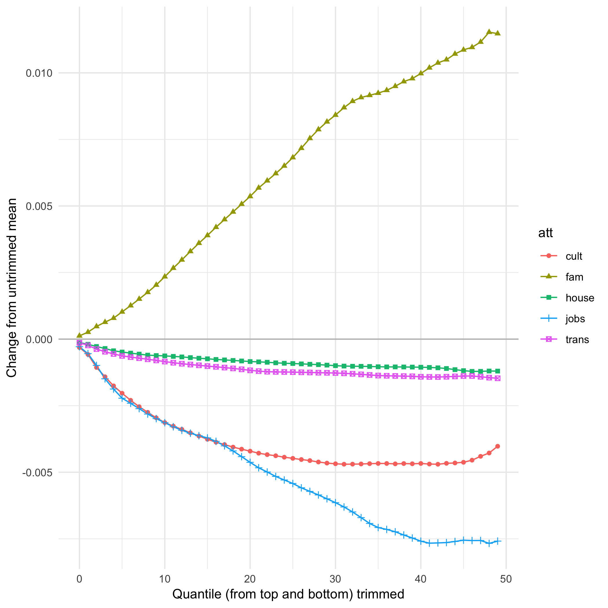
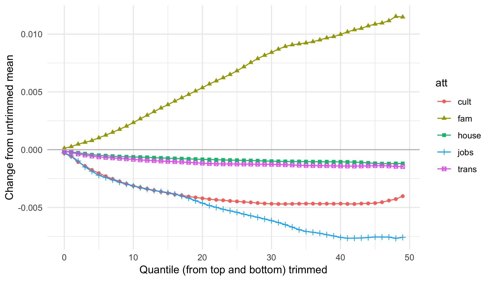
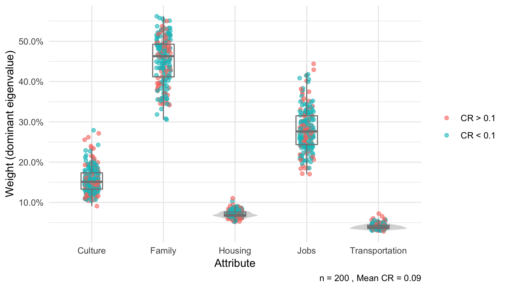
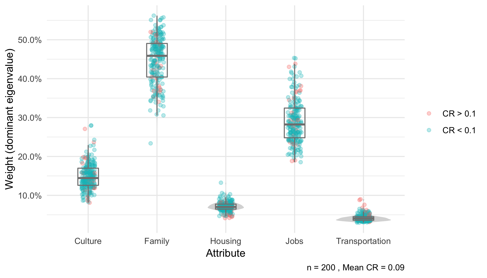
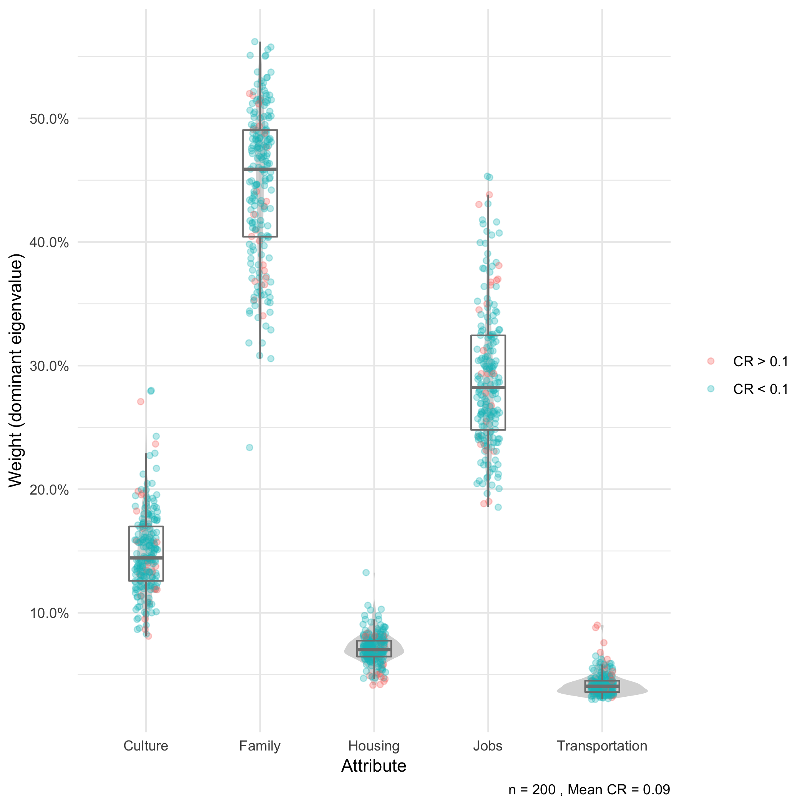

\newpage

# Introduction

The Analytic Hierarchy Process (AHP), introduced by @Saaty1987, is a versatile multi-criteria decision-making tool that allows individuals to rationally weigh attributes and evaluate alternatives presented to them. While most applications of the AHP are focused on implementation at the individual or small-scale, the AHP was increasingly adopted in survey designs, which involve a large number of decision-makers and a great deal of heterogeneity in responses. The tools currently available in `R` for the analysis of AHP data, such as the packages ``ahp`` by @Gluc2018 and ``Prize`` by @Dargahi2016, are excellent tools for performing the AHP at a small scale and offers are excellent in terms of interactivity,  user-friendliness, and for comparing alternatives.

However, researchers looking to adopt the AHP in the analysis of survey data often have to manually reformat their data, sometimes even involving dragging and copying across Excel spreadsheets, which is painstaking and prone to human error. Hitherto, there are no good ways of computing and visualising the heterogeneity amongst AHP decision-makers, which is common in survey data. Inconsistent choices are also prevalent in AHP conducted in the survey format, where it is impractical for enumerators to identify and correct for inconsistent responses on the spot when the surveys are delivered in paper format. Even if an electronic version that allows immediate feedback of consistency ratio is used, respondents asked to repeatedly change their answers are likely to be mentally fatigued. Censoring observations with inconsistency is likely to result in a greatly decreased statistical power of the sample, or may lead to unrepresentative samples and nonresponse bias.

The ``ahpsurvey`` package provides a workflow for researchers to quantify and visualise inconsistent pairwise comparisons that aids researchers in improving the AHP design and adopting appropriate analytical methods for the AHP.

Install the package directly from CRAN:


```r
install.packages("ahpsurvey")
```

\newpage

# Calculating priority weights
## Random data generation

First, we load the `ahpsurvey` library.

```r
library(ahpsurvey)
```

Lets generate some random data based on Saaty's example of choosing a city to live in described in @Saaty2004. In the spirit of transparent and replicable science, I will recreate Saaty's example of criteria weights by simulating 200 decision-makers who make their choices based on the underlying true weights. The dataset is generated using a normal random sample from the Saaty scale with the mean set as the true weight and the standard deviation set manually. With a higher standard deviation, it is expected that the pairwise comparison will be less consistent. The methods employed later will reveal which pairwise comparison is less consistent than others.


```r
## Defining attributes
set.seed(42)
atts <- c("cult", "fam", "house", "jobs", "trans")

colnames <- c("cult_fam", "cult_house", "cult_jobs", "cult_trans",
              "fam_house", "fam_jobs", "fam_trans",
              "house_jobs", "house_trans",
              "jobs_trans")

## True weights derived from Saaty's example
weight <- c(5,-3,2,-5,
            -7,-1,-7,
            4,-3,
            -7)

## Defining the saaty scale
saatyscale <- c(-9:-2, 1:9)
nobs <- 200

## saatyprob creates a list of probabilities in the saaty scale for being sampled given
## the position of the weight in the weight list (x) and standard deviation (sd)

saatyprob <- function(x, sd) dnorm(saatyscale, mean = weight[x], sd = sd) 

## Standard deviation set on saatyprob(x, *sd*)
cult_fam <- sample(saatyscale, nobs, prob = saatyprob(1, 2), replace = TRUE)
cult_house <- sample(saatyscale, nobs, prob = saatyprob(2, 1), replace = TRUE)
cult_jobs <- sample(saatyscale, nobs, prob = saatyprob(3, 2), replace = TRUE)
cult_trans <- sample(saatyscale, nobs, prob = saatyprob(4, 1.5), replace = TRUE)
fam_house <- sample(saatyscale, nobs, prob = saatyprob(5, 2), replace = TRUE)
fam_jobs <- sample(saatyscale, nobs, prob = saatyprob(6, 1.5), replace = TRUE)
fam_trans <- sample(saatyscale, nobs, prob = saatyprob(7, 2.5), replace = TRUE)
house_jobs <- sample(saatyscale, nobs, prob = saatyprob(8, 0.5), replace = TRUE)
house_trans <- sample(saatyscale, nobs, prob = saatyprob(9, 0.5), replace = TRUE)
jobs_trans <- sample(saatyscale, nobs, prob = saatyprob(10, 1), replace = TRUE)

city.df <- data.frame(fam_house, cult_house, cult_jobs, cult_trans,
                      cult_fam, fam_jobs, fam_trans,
                      house_jobs, house_trans,
                      jobs_trans)
head(city.df[,1:7])
```

```
##   fam_house cult_house cult_jobs cult_trans cult_fam fam_jobs fam_trans
## 1        -4         -2         2         -6        2       -4        -8
## 2        -4         -4         1         -4        2       -2        -8
## 3        -7         -2         1         -3        4       -3        -5
## 4        -8         -4         3         -4        8        1        -7
## 5        -8         -3         5         -6        3        1        -4
## 6        -7         -4         2         -4        6       -2        -4
```

Here, we have simulated the responses of 200 individual decision-makers regarding their priorities for which city to live in, based on the true weights from Saaty's journal article, with some added random deviations of the weight.

Some caveats prior to entering the data into the `ahp.mat` function. First, `ahp.mat` does not recognise the names of the original dataframe, and figures out which attribute corresponds to which entirely based on the order of the columns. For example, when the attributes are A, B, C and D, the dataframe should be ordered in ``A_B, A_C, A_D, B_C, B_D, C_D``, and the attributes listed as ``c(A,B,C,D)``, in that order.

To illustrate this, I have deliberately messed up the order of the variables in the above dataframe. To reorder it, I recommend the ``select`` function in the dplyr package.


```r
city.df <- city.df %>%
  select(cult_fam, cult_house, cult_jobs, cult_trans,
         fam_house, fam_jobs, fam_trans,
         house_jobs, house_trans,
         jobs_trans)
```

For your testing convenience, I have used the above procedure (with the random distributions) to simulate 200 decision-makers' choices and included this within the package, which can be called using `data(city200)`, after loading the `ahpsurvey` package.

## Generating pairwise comparison matrices

A short revision of the AHP survey methodology:


|Rating |Definition                                                  |
|:------|:-----------------------------------------------------------|
|1      |Two characteristics are equally important                   |
|2      |Between 1 and 3                                             |
|3      |The preferred characteristics are slightly more important   |
|4      |Between 3 and 5                                             |
|5      |The preferred characteristics are moderately more important |
|6      |Between 5 and 7                                             |
|7      |The preferred characteristics are strongly more important   |
|8      |Between 7 and 9                                             |
|9      |The preferred characteristics are absolutely more important |

A Saaty scale is composed of 9 items on each end (17 options per pairwise comparison) where decision-makers are asked to indicate how much attribute/ characteristic A is more preferred to B (or vice versa), and how much it is preferred in a 9-point scale. Respondents are asked to make pairwise comparisons for a range of attributes, and indicate their preferences for each of them.

Based on the above scale, a pairwise comparison matrix of $N$ attributes for the $k^{th}$ individual is obtained:

$$ \mathbf{S_k} =\begin{pmatrix}
                      a_{1,1} & a_{1,2} & \cdots & a_{1,N} \\
                      a_{2,1} & a_{2,2} & \cdots & a_{2,N} \\
                      \vdots  & \vdots  & a_{i,j} & \vdots  \\
                      a_{N,1} & a_{N,2} & \cdots & a_{N,N}
                      \end{pmatrix} $$

Where $a_{i,j}$ represents the pairwise comparison between the attribute $i$ and $j$. If $i$ is more important than $j$ for 6 units, $a_{i,j} = 6$ and $a_{j,i} = \frac{1}{6}$, i.e. the reciprocal. Data must be reformatted into this pairwise comparison matrix format to proceed.

The reformatting of the survey data (with one row per individual) into such a matrix necessary for further analysis is cumbersome for researchers. Furthermore, as researchers conducting the AHP as an integrated part of a survey, we typically receive data in the above format: the pairwise comparisons are coded in positive and negative numbers as opposed to reciprocals. In the pairwise comparison of `cult_fam`:

\begin{center}
\textit{Culture} 9 8 7 \textbf{6} 5 4 3 2 1 2 3 4 5 6 7 8 9 \textit{Family}
\end{center}

In the case where the decision-maker chose 6, the sensible codebook maker would code it as -6, which denotes that *Culture* is more important than *Family* in 6 units for that decision-maker. For `ahp.mat` to work, the value in A_B variable have to be the importance A has over B in positive values. In this case, the values should be converted from negative to positive, and the negative values would be converted to its reciprocal in the pairwise matrix. When data is coded in the above way, set `negconvert = TRUE`. If the data is already coded in the reciprocal (as opposed to negatives), set `reciprocal = FALSE`.

``ahp.mat`` takes four arguments: 

*   `df`:  the dataframe

*   `atts`: a list of attributes in the correct order 

*   `negconvert`: whether to convert all positive values to negative (logical, defaults to `FALSE`)

*   `reciprocal`: whether to convert negative values (after `negconvert`) to its reciprocals (defaults to `TRUE`).


```r
city.df %>%
  ahp.mat(atts = atts, negconvert = TRUE) %>% 
  head(3)
```

```
## [[1]]
##        cult   fam house  jobs trans
## cult  1.000 0.500 2.000 0.500     6
## fam   2.000 1.000 4.000 4.000     8
## house 0.500 0.250 1.000 0.250     3
## jobs  2.000 0.250 4.000 1.000     8
## trans 0.167 0.125 0.333 0.125     1
## 
## [[2]]
##       cult   fam house  jobs trans
## cult  1.00 0.500 4.000 1.000     4
## fam   2.00 1.000 4.000 2.000     8
## house 0.25 0.250 1.000 0.250     3
## jobs  1.00 0.500 4.000 1.000     7
## trans 0.25 0.125 0.333 0.143     1
## 
## [[3]]
##        cult   fam house  jobs trans
## cult  1.000 0.250 2.000 1.000     3
## fam   4.000 1.000 7.000 3.000     5
## house 0.500 0.143 1.000 0.250     3
## jobs  1.000 0.333 4.000 1.000     6
## trans 0.333 0.200 0.333 0.167     1
```

The ahp.mat function creates a list of pairwise comparison matrices for all decision-makers. As seen above, the pairwise matrices resembles the original Saaty criteria weights, which is a good sanity check.

## Individual priority weights

The `ahp.indpref` function computes the individual priorities of the decision-makers, and returns a `data.frame` containing the priority weights of the decision-makers. The three arguments are as follows:

* `ahpmat`: The list of matrices created by `ahp.mat`.

* `atts`: a list of attributes in the correct order.

* `method`: It normalises the matrices so that all of the columns add up to 1, and then computes the averages of the row as the priority weights of each attribute. Four modes of finding the averages are available:  
  + ``arithmetic``: the arithmetic mean
  + ``geometric``: the geometric mean
  + ``rootmean``: the square root of the sum of the squared value
  + ``eigen``: the individual priority weights are computed using the Dominant Eigenvalues method described in @Saaty2003

Here I demonstrate the difference of using arithmetic aggregation and dominant eigenvalue methods. In my own testing with real datasets, a much higher proportion of respondents have at least one attribute with a difference larger than 0.05 due to presence of inconsistent and heterogeneous responses.


```r
cityahp <- city.df %>% 
  ahp.mat(atts, negconvert = T)
eigentrue <- ahp.indpref(cityahp, atts, method = "eigen")
geom <- ahp.indpref(cityahp, atts, method = "arithmetic")
error <- data.frame(id = 1:length(cityahp), maxdiff = apply(abs(eigentrue - geom), 1, max))
error %>%
  ggplot(aes(x = id, y = maxdiff)) +
  geom_point() +
  geom_hline(yintercept = 0.05, linetype = "dashed", color = "red") +
  geom_hline(yintercept = 0, color = "gray50") +
  scale_x_continuous("Respondent ID") +
  scale_y_continuous("Maximum difference") +
  theme_minimal()
```



## Aggregated priority weights

The `ahp.aggpref` function computes the aggregated priorities of all decision-makers using the specified methods. The following arguments are given:

* `method`: Same as `ahp.indpref`. It normalises the matrices so that all of the columns add up to 1, and then computes the averages of the row as the priority weights of each attribute. Four modes of finding the averages are available:  
  + ``arithmetic``: the arithmetic mean
  + ``geometric``: the geometric mean
  + ``rootmean``: the square root of the sum of the squared value
  + ``eigen``: the individual priority weights are computed using the Dominant Eigenvalues method described in @Saaty2003
  
* `aggmethod`: how to aggregate the individual priorities. 
  + `arithmetic`, `geometric` and `rootmean` (same principle as `method`)
  + `tmean` trimmed mea
  + `tgmean` trimmed geometric mean
  + `sd` returns the standard deviation from the arithmetic mean.

When `tmean` or `tgmean` is specified, `ahpsurvey` needs an additional argument `qt`, which specifes the quantile which the top **and** bottom priority weights are trimmed. `qt = 0.25` specifies that the aggregation is the arithmetic mean of the values from the 25 to 75 percentile. This visualisation offers researchers a good way to determine the amount of priority weights to be trimmed. By default, `qt = 0`, hence the result you would get by using `tmean` and `tgmean` and not specifying `qt` is the same as `arithmetic` and `geometric` respectively.


```r
amean <- ahp.aggpref(cityahp, atts, method = "arithmetic")
amean
```

```
##   cult    fam  house   jobs  trans 
## 0.1620 0.4367 0.0761 0.2827 0.0424
```

Two steps were simutaneously conducted in the above command:

1.    Compute the individual priorities of each decision-maker (using `method`)

2.    Aggregate the priorities (using `aggmethod`)

By default, the two steps rely on the same aggregation method as specified in `method` (unless when `method = "eigen"`, where `aggmethod` defaults to `arithmetic`). However, it is possible to specify different aggregation methods for the individual and group level. For instance, one can specify that in the individual level, the arithmetic mean is used to compute the individual priorities; the priorities are aggregated using a trimmed mean by trimming observations higher and lower quantile. 


```r
qtresults <- matrix(nrow = 50, ncol = 5, data = NA)
for (q in 1:50){
  qtresults[q,] <- ahp.aggpref(cityahp, atts, method = "arithmetic", 
                               aggmethod = "tmean", qt = (q-1)/100)
}
colnames(qtresults) <- atts
qtresults %>%
  as.data.frame() %>%
  mutate(trimperc = 1:nrow(qtresults)-1) %>%
  mutate(cult = cult - amean[1],
         fam = fam - amean[2],
         house = house - amean[3],
         jobs = jobs - amean[4],
         trans = trans - amean[5]) %>%
  gather(cult, fam, house, jobs, trans, key = "att", value = "weight") %>%
  ggplot(aes(x = trimperc, y = weight, group = att, shape = att, color = att, fill = att)) +
  geom_line() +
  geom_point() +
  scale_x_continuous("Quantile (from top and bottom) trimmed") +
  scale_y_continuous("Change from untrimmed mean") +
  geom_hline(yintercept = 0, color = "gray") +
  theme_minimal()
```



It is also possible to quantify the heterogeneity amongst decision-makers' priorities, information possibly lost by group aggregation. This is specified using `aggmethod = "sd"`:


```r
mean <- city.df %>%
  ahp.mat(atts = atts, negconvert = TRUE) %>% 
  ahp.aggpref(atts, method = "arithmetic")

sd <- city.df %>%
  ahp.mat(atts = atts, negconvert = TRUE) %>% 
  ahp.aggpref(atts, method = "arithmetic", aggmethod = "sd")

t(data.frame(mean, sd))%>% kable()
```


|     |  cult|   fam| house|  jobs| trans|
|:----|-----:|-----:|-----:|-----:|-----:|
|mean | 0.162| 0.437| 0.076| 0.283| 0.042|
|sd   | 0.033| 0.054| 0.009| 0.048| 0.007|

## Aggregated individual judgements

Similarly, `ahp.aggjudge` aggregates the individual judgements of all decision-makers to generate a row-standardised pairwise comparison matrix of all decision-makers. This allows one to compare priorities directly based on the aggregated pairwise judgements of all decision-makers. It takes the argument `aggmethod` with the exact same options as `ahp.aggpref`. 


```r
city.df %>%
  ahp.mat(atts = atts, negconvert = TRUE) %>% 
  ahp.aggjudge(atts, aggmethod = "geometric")
```

```
##        cult   fam house  jobs trans
## cult  1.000 0.220 3.093 0.488  4.64
## fam   4.541 1.000 6.461 1.704  6.15
## house 0.323 0.155 1.000 0.249  2.93
## jobs  2.048 0.587 4.019 1.000  7.04
## trans 0.216 0.163 0.342 0.142  1.00
```
\newpage
# Measuring and visualising consistency

## Measuring consistency

The consistency indices and consistency ratio of a given choice is defined by the following equation:

$$CR = \bigg(\frac{\lambda_{max}-n}{n-1}\bigg)\bigg(\frac{1}{RI}\bigg)$$

Where $\lambda_{max}$ is the maximum eigenvalue of the pairwise comparison vector and $n$ is the number of attributes. The $RI$ when five attributes are present is 1.11. 

The RI was derived from @Saaty2007fuzzy, as follows:

|   |  1|  2|    3|    4|    5|    6|    7|   8|    9|   10|   11|   12|   13|   14|   15|
|:--|--:|--:|----:|----:|----:|----:|----:|---:|----:|----:|----:|----:|----:|----:|----:|
|RI |  0|  0| 0.52| 0.89| 1.11| 1.25| 1.35| 1.4| 1.45| 1.49| 1.52| 1.54| 1.56| 1.58| 1.59|

Saaty showed that when the $CR$ is higher than 0.1, the choice is deemed to be inconsistent. The `ahpsurvey` package allows researchers to quantify the inconsistency among the decision-makers and make decisions in their analysis, either to drop inconsistent observations or look for ways to adjust for inconsistency. 
As a proof of concept, I use the original weights to compute the consistency ratio, and it returned the value which Saaty got, 0.05.


```r
sample_mat <- ahp.mat(t(weight), atts, negconvert = TRUE)

cr_std <- ahp.cr(sample_mat, atts)
cr_std
```

```
## [1] 0.0507
```

The `ahp.cr` function returns a vector of $CR$ that can be merged to other dataframes as a measure of the individuals' consistency.


```r
cr <- city.df %>%
  ahp.mat(atts, negconvert = T) %>% 
  ahp.cr(atts)
table(cr <= 0.1)
```

```
## 
## FALSE  TRUE 
##    70   130
```

## Visualising individual priorities and consistency ratios

The `ahp.indpref` function provides a detailed account of each individuals' priorities and its corresponding weighting. An overlay of the violin density, boxplots and jitter plots is useful in visualising the heterogeneity in weights each respondent gives.


```r
thres <- 0.1
dict <- c("cult" = "Culture", 
          "fam" = "Family", 
          "house" = "Housing", 
          "jobs" = "Jobs", 
          "trans" = "Transportation")

cr.df <- city.df %>%
  ahp.mat(atts, negconvert = TRUE) %>% 
  ahp.cr(atts) %>% 
  data.frame() %>%
  mutate(rowid = 1:length(cr), cr.dum = as.factor(ifelse(cr <= thres, 1, 0))) %>%
  select(cr.dum, rowid)

city.df %>%
  ahp.mat(atts = atts, negconvert = TRUE) %>% 
  ahp.indpref(atts, method = "eigen") %>% 
  mutate(rowid = 1:nrow(eigentrue)) %>%
  left_join(cr.df, by = 'rowid') %>%
  gather(cult, fam, house, jobs, trans, key = "var", value = "pref") %>%
  ggplot(aes(x = var, y = pref)) + 
  geom_violin(alpha = 0.6, width = 0.8, color = "transparent", fill = "gray") +
  geom_jitter(alpha = 0.6, height = 0, width = 0.1, aes(color = cr.dum)) +
  geom_boxplot(alpha = 0, width = 0.3, color = "#808080") +
  scale_x_discrete("Attribute", label = dict) +
  scale_y_continuous("Weight (dominant eigenvalue)", 
                     labels = scales::percent, 
                     breaks = c(seq(0,0.7,0.1))) +
  guides(color=guide_legend(title=NULL))+
  scale_color_discrete(breaks = c(0,1), 
                       labels = c(paste("CR >", thres), 
                                  paste("CR <", thres))) +
  labs(NULL, caption = paste("n =", nrow(city.df), ",", "Mean CR =",
                           round(mean(cr),3)))+
  theme_minimal()
```


\newpage

# Dealing with inconsistent and missing data

## Identifying inconsistent pairwise comparisons

Not only are survey designers interested in the level of inconsistency present in their surveys, they are also interested in the source of inconsistency. Are respondents making inconsistent choices because some attributes are ill-defined, or that a pairwise comparison between those attributes simply do not make sense? `ahpsurvey` provides easy tools for researchers to identify the pairwise comparisons which respondents make inconsistent choices, which could contribute to better survey designs.

The `ahp.pwerror` compares the pairwise matrix of each individual with a Saaty Matrix (that has the property of $CR = 0$) generated using the obtained priority weights. It is always better to understand this with an example.

The Saaty matrix is defined as the following:

$$ \mathbf{S} =\begin{pmatrix}
                      \frac{p_{1}}{p_{1}} & \frac{p_{1}}{p_{2}} & \cdots & \frac{p_{1}}{p_{N}} \\
                      \frac{p_{2}}{p_{1}} & \frac{p_{2}}{p_{2}} & \cdots & \frac{p_{2}}{p_{N}} \\
                      \vdots  & \vdots  & \frac{p_{i}}{p_{j}} & \vdots  \\
                      \frac{p_{N}}{p_{1}} & \frac{p_{N}}{p_{2}} & \cdots & \frac{p_{N}}{p_{N}}
                      \end{pmatrix} $$

Where $p_{i}$ and $p_{j}$ are the final weights of the $i^{th}$ and $j^{th}$ attribute respectively, and $N$ is the number of attributes.

I am no math major, and I find linear algebra intimidating. Here, I will demonstrate with an example from Saaty's original matrix how we arrive the consistency error matrix from the original pairwise matrix.

Consider this matrix of the original pairwise comparison and the resultant priority weights below.

```
## [[1]]
##        cult   fam house  jobs trans
## cult  1.000 0.200 3.000 0.500     5
## fam   5.000 1.000 7.000 1.000     7
## house 0.333 0.143 1.000 0.250     3
## jobs  2.000 1.000 4.000 1.000     7
## trans 0.200 0.143 0.333 0.143     1
```

The goal is to compare the above matrix with a perfectly consistent Saaty matrix generated from the priority weights calculated using the dominant eigenvalue method.

```r
priority <- t(ahp.indpref(sample_mat, atts, method = "eigen"))
priority
```

```
##         [,1]
## cult  0.1522
## fam   0.4335
## house 0.0716
## jobs  0.3050
## trans 0.0378
```

The priority matrix is generated by multiplying its transposed reciprocal version of itself. This is no rocket science -- for example, the cult fam comparison is calculated by dividing weight of cult by the weight of fam, 0.152 / 0.433 =  0.351.


```r
S <- priority %*% t((priority)^-1)
S
```

```
##        cult    fam house  jobs trans
## cult  1.000 0.3511 2.127 0.499  4.02
## fam   2.849 1.0000 6.058 1.421 11.46
## house 0.470 0.1651 1.000 0.235  1.89
## jobs  2.004 0.7037 4.262 1.000  8.07
## trans 0.249 0.0872 0.528 0.124  1.00
```

The transposed Saaty matrix is multiplied element-by-element with the original pairwise comparison matrix (or taken its reciprocals if the product is smaller than 1) to generate a measure of how well the pairwise matrix resembles the Saaty matrix. If the matrix perfectly resembles the transposed Saaty matrix, the consistency error matrix (shown below) should very close to 1. This matrix is expressed as the following:

$$\epsilon_{ij} = a_{ij}\frac{p_{j}}{p_{i}}$$
Where $a_{ij}$ is the value in the pairwise comparison matrix. The values can be obtained with a simple matrix multiplication of the transpose of $\mathbf{S}$.


```r
sample_mat[[1]] * t(S)
```

```
##        cult   fam house  jobs trans
## cult  1.000 0.570 1.411 1.002 1.243
## fam   1.755 1.000 1.156 0.704 0.611
## house 0.709 0.865 1.000 1.066 1.585
## jobs  0.998 1.421 0.938 1.000 0.868
## trans 0.805 1.637 0.631 1.152 1.000
```

The process is automated in `ahp.error`. `ahp.error` also loops through all pairwise comparison matrices generated by `ahp.mat`, and returns a list of error consistency matrices. The consistency matrices quantifies the inconsistency underlying each pairwise comparison of each decision-maker. I can also use `reciprocal = TRUE` to put all the errors that are above 1 into the upper triangular matrix. If `reciprocal = FALSE`, the below output will be essentially the same as the matrix above.


```r
error <- ahp.error(sample_mat, atts, reciprocal = TRUE)
error
```

```
## [[1]]
##       cult  fam house jobs trans
## cult     1 1.76  1.41 1.00  1.24
## fam     NA 1.00  1.16 1.42  1.64
## house   NA   NA  1.00 1.07  1.59
## jobs    NA   NA    NA 1.00  1.15
## trans   NA   NA    NA   NA  1.00
```

Here I demonstrate how to perform `ahp.error` in our 200 simulated decision-makers and compute the mean consistency error for each pairwise comparison. By using `reciprocal = TRUE`, I put all the errors that are above 1 into the upper triangular matrix so that we can summarise (by taking geometric mean) quickly the average error of each pairwise comparison (larger means more error). 


```r
gm_mean <- function(x, na.rm=TRUE){
  exp(sum(log(x[x > 0]), na.rm=na.rm) / length(x))
}

mat <- cityahp %>%
  ahp.error(atts, reciprocal = TRUE) %>%
  unlist() %>%
  as.numeric() %>%
  array(dim=c(length(atts), length(atts), length(cityahp))) %>%
  apply(c(1,2), gm_mean)

colnames(mat) <- rownames(mat) <- atts

mat
```

```
##       cult  fam house jobs trans
## cult     1 1.89  1.55 1.92  1.29
## fam      1 1.00  1.33 1.59  2.19
## house    1 1.00  1.00 1.37  1.24
## jobs     1 1.00  1.00 1.00  1.13
## trans    1 1.00  1.00 1.00  1.00
```

The above matrix is a quick way for revealing inconsistencies within the data, but it is not the best way as it can be biased. If one or more decision-maker makes an incredibly inconsistent pairwise comparison, the consistency error for that pairwise comparison will be very high, which biases the mean error consistency of that pairwise comparison upwards even if many other decision-makers are making perfectly consistent choices. 

## Finding inconsistent pairwise comparisons by maximum

A better way, as I reckon, would be to extract the pairwise comparison with the maximum inconsistency error, and returning a list of the most inconsistent pairwise comparisons for each decision-maker. This process is automated in the `ahp.pwerror` function, which returns a dataframe of the top three most inconsistent pairwise comparison made by each decision-maker.


```r
city.df %>%
  ahp.mat(atts) %>%
  ahp.pwerror(atts) %>%
  head()
```

```
##         top1       top2       top3
## 1   fam_jobs house_jobs  cult_jobs
## 2 cult_house house_jobs  fam_trans
## 3  fam_trans   cult_fam cult_trans
## 4   cult_fam  cult_jobs cult_house
## 5  cult_jobs  fam_trans   fam_jobs
## 6  fam_trans   cult_fam cult_house
```

A better way to visualise the pairwise comparisons is a bar chart:


```r
cityahp %>%
  ahp.pwerror(atts) %>% 
  gather(top1, top2, top3, key = "max", value = "pair") %>%
  table() %>%
  as.data.frame() %>%
  ggplot(aes(x = pair, y = Freq, fill = max)) + 
  geom_bar(stat = 'identity') +
  scale_y_continuous("Frequency", breaks = c(seq(0,180,20))) +
  scale_fill_discrete(breaks = c("top1", "top2", "top3"), labels = c("1", "2", "3")) +
  scale_x_discrete("Pair") +
  guides(fill = guide_legend(title="Rank")) +
  theme(axis.text.x = element_text(angle = 20, hjust = 1),
        panel.background = element_rect(fill = NA),
        panel.grid.major.y = element_line(colour = "grey80"),
        panel.grid.major.x = element_blank(),
        panel.ontop = FALSE)
```

```
## Warning: attributes are not identical across measure variables;
## they will be dropped
```


The results are favorable -- the frequency which a pairwise comparison is the most inconsistent for that decision-maker is reflective of the degree of randomness I have used to generate the dataset. The cult_fam, cult_jobs and fam_trans are assigned the highest standard deviations for the normal random draw, which partly contributes to its high frequency of being in the most inconsistent pairwise comparison in the chart.


## Transforming inconsistent matrices

Inconsistent pairwise matrices are problematic for AHP survey analysts. @Harker1987 described a method to replace inconsistent values: using the error matrix we have derived above, we can suggest a value that would reduce the inconsistency. Consider the below pairwise matrix found in Saaty's explication of Harker's method:


```r
family <- c(1,1/5,1/3,1/7,1/6,1/6,3,4,
            5,1,3,1/5,1/3,1/3,5,7,
            3,1/3,1,1/6,1/3,1/4,1/6,5,
            7,5,6,1,3,4,7,8,
            6,3,3,1/3,1,2,5,6,
            6,3,4,1/4,1/2,1,5,6,
            1/3,1/5,6,1/7,1/5,1/5,1,2,
            1/4,1/7,1/5,1/8,1/6,1/6,1/2,1)

fam.mat <- list(matrix(family, nrow = 8 , ncol = 8))

atts <- c("size", "trans", "nbrhd", "age", "yard", "modern", "cond", "finance")

rownames(fam.mat[[1]]) <- colnames(fam.mat[[1]]) <- atts

fam.mat[[1]] %>% kable()
```


|        |  size| trans| nbrhd| age|  yard| modern|  cond| finance|
|:-------|-----:|-----:|-----:|---:|-----:|------:|-----:|-------:|
|size    | 1.000| 5.000| 3.000|   7| 6.000|   6.00| 0.333|   0.250|
|trans   | 0.200| 1.000| 0.333|   5| 3.000|   3.00| 0.200|   0.143|
|nbrhd   | 0.333| 3.000| 1.000|   6| 3.000|   4.00| 6.000|   0.200|
|age     | 0.143| 0.200| 0.167|   1| 0.333|   0.25| 0.143|   0.125|
|yard    | 0.167| 0.333| 0.333|   3| 1.000|   0.50| 0.200|   0.167|
|modern  | 0.167| 0.333| 0.250|   4| 2.000|   1.00| 0.200|   0.167|
|cond    | 3.000| 5.000| 0.167|   7| 5.000|   5.00| 1.000|   0.500|
|finance | 4.000| 7.000| 5.000|   8| 6.000|   6.00| 2.000|   1.000|

```r
ahp.cr(fam.mat, atts)
```

```
## [1] 0.17
```

The consistency ratio of the pairwise matrix is unsatisfactory. The procedure involved in Harker's method is as follows:

1. Find the pairwise comparison with the maximum error (the $i^{th}$ and $j^{th}$ element)
2. Duplicate the matrix and replace the pairwise comparison in the new matrix with the maximum error with 0, and its two corresponding diagonal entries with 2
3. Compute new weights $w_i$ and $w_j$ (as in `ahp.indpref` with `method = "eigen"`)
4. Replace the pairwise comparison with $\frac{w_i}{w_j}$ and $\frac{w_j}{w_i}$

For an in-depth explication see @Saaty2003. Here I replicate the results in @Saaty2003 with the `ahp.harker` function.


```r
edited <- ahp.harker(fam.mat, atts, iterations = 10, stopcr = 0.1)
```

```
## [1] "Ind 1 Iterations: 1"
```

```r
edited[[1]]%>% kable() 
```


|        |  size| trans| nbrhd| age|  yard| modern|  cond| finance|
|:-------|-----:|-----:|-----:|---:|-----:|------:|-----:|-------:|
|size    | 1.000| 5.000| 3.000|   7| 6.000|   6.00| 0.333|   0.250|
|trans   | 0.200| 1.000| 0.333|   5| 3.000|   3.00| 0.200|   0.143|
|nbrhd   | 0.333| 3.000| 1.000|   6| 3.000|   4.00| 0.459|   0.200|
|age     | 0.143| 0.200| 0.167|   1| 0.333|   0.25| 0.143|   0.125|
|yard    | 0.167| 0.333| 0.333|   3| 1.000|   0.50| 0.200|   0.167|
|modern  | 0.167| 0.333| 0.250|   4| 2.000|   1.00| 0.200|   0.167|
|cond    | 3.000| 5.000| 2.180|   7| 5.000|   5.00| 1.000|   0.500|
|finance | 4.000| 7.000| 5.000|   8| 6.000|   6.00| 2.000|   1.000|

```r
ahp.cr(edited, atts)
```

```
## [1] 0.0828
```

As seen here, element `[3,7]` is the most inconsistent pairwise comparison, thus it was replaced with a more consistent value 0.459.

`ahp.harker` takes five optional arguments:

* `round` is logical and tells `ahp.harker` whether to convert the newly replaced values to  integers and its reciprocals, and can be set to `TRUE` if desired.

* `iterations` denotes how many pairwise comparisons should be changed. For example, if `iterations = 3`, `ahp.harker` changes the first, second, and third most inconsistent pairwise comparisons using that method. Researchers should think carefully how many pairwise comparisons should be replaced, as every time a pairwise comparison is replaced, some information is inevitably lost. Note that the maximum number of iterations is capped at $iterations \leq \frac{1}{2}n(n-1)$ with $n$ being the number of attributes.

* `stopcr`: The stopping Consistency Ratio. It complements `iterations` by giving `iterations` a criteria to stop when a matrix is sufficiently consistent. `ahp.harker` will continue looping and replacing more elements of the pairwise comparison matrices until the consistency ratio of the new matrix is lower than `stopcr`, or the maximum number of iterations is reached, and will stop and move onto the next individual. When `stopcr` is set, the number of replaced elements will differ amongst each decision-maker. Thus, it is advised that the analyst set `printiter = TRUE` to see how many iterations has the pairwise matrix of that individual has been modified by the algorithm.

* `limit`: In many cases, the algorithm will intend to replace a value with a number higher than 9 or lower than 1/9. `limit` caps the maximum and minimum value of the replacement to 9 and 1/9 respectively.

* `printiter` is a logical argument of whether the number of iterations taken for each pairwise matrix is reported or not. Generally it is not needed if `stopcr` is not specified. When `stopcr` is specified, this is a good way of identifying how many pairwise comparisons are actually replaced by the algorithm for each decision maker. The printout above shows `"Ind 1 Iterations: 1"`, which shows that although I specified `iterations = 10`, individual 1 (`Ind 1`) was only iterated one time before it reached the target consistency ratio, 0.1. Only one element was replaced.

I will demonstrate how `ahp.harker` improved the consistency of the decision-makers in our fictitious sample.


```r
crmat <- matrix(NA, nrow = 200, ncol = 11)
colnames(crmat) <- 0:10

atts <- c("cult", "fam", "house", "jobs", "trans")

crmat[,1] <- city.df %>%
    ahp.mat(atts, negconvert = TRUE) %>%
    ahp.cr(atts)

for (it in 1:10){
  crmat[,it+1] <- city.df %>%
    ahp.mat(atts, negconvert = TRUE) %>%
    ahp.harker(atts, iterations = it, stopcr = 0.1, 
               limit = T, round = T, printiter = F) %>%
    ahp.cr(atts)
}

data.frame(table(crmat[,1] <= 0.1), 
           table(crmat[,3] <= 0.1),
           table(crmat[,5] <= 0.1)) %>% 
  select(Var1, Freq, Freq.1, Freq.2) %>%
  rename("Consistent?" = "Var1", "No Iteration" = "Freq",
         "2 Iterations" = "Freq.1", "4 Iterations" = "Freq.2")
```

```
##   Consistent? No Iteration 2 Iterations 4 Iterations
## 1       FALSE           70           13            2
## 2        TRUE          130          187          198
```

While using Harker's method cannot completely lower the CR of all decision-makers to desired levels, it allows researchers to keep a lot more observations; whereas we would have to truncate 70 samples, now we only have to censor 22 samples with 1 iteration.


```r
crmat %>% 
  as.data.frame() %>%
  gather(key = "iter", value = "cr", `0`, 1,2,3,4,5,6,7,8,9,10,11) %>%
  mutate(iter = as.integer(iter)) %>%
  ggplot(aes(x = iter, y = cr, group = iter)) +
  geom_hline(yintercept = 0.1, color = "red", linetype = "dashed")+
  geom_jitter(alpha = 0.2, width = 0.3, height = 0, color = "turquoise4") +
  geom_boxplot(fill = "transparent", color = "#808080", outlier.shape = NA) + 
  scale_x_continuous("Iterations", breaks = 0:10) +
  scale_y_continuous("Consistency Ratio") +
  theme_minimal()
```




```r
it <- 1
thres <- 0.1
cr.df1 <- data.frame(cr = city.df %>%
  ahp.mat(atts, negconvert = TRUE) %>%
  ahp.harker(atts, iterations = it, stopcr = 0.1, limit = T, round = T, printiter = F) %>%
  ahp.cr(atts))

cr.df2 <- cr.df1 %>%
  mutate(rowid = 1:nrow(city.df), cr.dum = as.factor(ifelse(. <= thres, 1, 0))) %>%
  select(cr.dum, rowid)

city.df %>%
  ahp.mat(atts = atts, negconvert = TRUE) %>% 
  ahp.harker(atts, iterations = it, stopcr = 0.1, limit = T, round = T, printiter = F) %>%
  ahp.indpref(atts, method = "eigen") %>% 
  mutate(rowid = 1:nrow(city.df)) %>%
  left_join(cr.df2, by = 'rowid') %>%
  gather(cult, fam, house, jobs, trans, key = "var", value = "pref") %>%
  ggplot(aes(x = var, y = pref)) + 
  geom_violin(alpha = 0.6, width = 0.8, color = "transparent", fill = "gray") +
  geom_jitter(alpha = 0.3, height = 0, width = 0.1, aes(color = cr.dum)) +
  geom_boxplot(alpha = 0, width = 0.3, color = "#808080") +
  scale_x_discrete("Attribute", label = dict) +
  scale_y_continuous("Weight (dominant eigenvalue)", 
                     labels = scales::percent, breaks = c(seq(0,0.7,0.1))) +
  guides(color=guide_legend(title=NULL))+
  scale_color_discrete(breaks = c(0,1), 
                       labels = c(paste("CR >", thres), 
                                  paste("CR <", thres))) +
  labs(NULL, caption =paste("n =",nrow(city.df), ",", "Mean CR =",round(mean(cr),3)))+
  theme_minimal()
```



Let's take a look at how applying Harker's method affects the overall aggregated priorities of the population.


```r
options(scipen = 99)
inconsistent <- city.df %>%
  ahp.mat(atts = atts, negconvert = TRUE) %>% 
  ahp.aggpref(atts, method = "eigen")

consistent <- city.df %>%
  ahp.mat(atts = atts, negconvert = TRUE) %>% 
  ahp.harker(atts, iterations = 5, stopcr = 0.1, limit = T, round = T, printiter = F) %>%
  ahp.aggpref(atts, method = "eigen")

true <- t(ahp.indpref(sample_mat, atts, method = "eigen"))

aggpref.df <- data.frame(Attribute = atts, true,inconsistent,consistent) %>%
  mutate(error.incon = abs(true - inconsistent),
         error.con = abs(true - consistent))

aggpref.df
```

```
##   Attribute   true inconsistent consistent error.incon error.con
## 1      cult 0.1522       0.1526     0.1427    0.000443   0.00945
## 2       fam 0.4335       0.4483     0.4388    0.014818   0.00537
## 3     house 0.0716       0.0705     0.0698    0.001031   0.00178
## 4      jobs 0.3050       0.2758     0.2886    0.029215   0.01638
## 5     trans 0.0378       0.0397     0.0424    0.001835   0.00454
```

Here I present the aggregated weights of the pairwise matrices without and with treatment with Harker's method, the aggregated priorities derived from the true weights of the sample, as well as the deviation of the priorities from the true weights. Because improving the consistency of the matrix does not necessarily increase the validity of the matrix, it is imperative that researchers consider other ways to improve consistency, ideally asking respondents to reconsider their choices, whenever inconsistency arises. 

While there are strong arguments against replacing inconsistent values without the decision-maker's consent for the sake of satisfying the consistency ratio criterion of CR < 0.1 (see @Saaty2007fuzzy), it is often not possible for survey executers to resolicit answers from their respondents after AHP analysis, whereas truncating inconsistent decisions may make the dataset unrepresentative of the population. Researchers should think carefully and explain fully the methods used to process AHP data. 

## Imputing missing pairwise comparison matrices

Missing data is a common feature in surveys. Harker's method was originally developed to complete incomplete pairwise comparison matrices, and can be implemented here using the same strategy as `ahp.harker`. 


```r
missing.df <- city.df[1:10,]
for (i in 1:10){
  missing.df[i, round(runif(1,1,10))] <- NA
  if (i > 7){
    missing.df[i, round(runif(1,2,10))] <- NA
  }
}
missing.df[,1:7]
```

```
##    cult_fam cult_house cult_jobs cult_trans fam_house fam_jobs fam_trans
## 1         2         -2         2         -6        -4       -4        NA
## 2         2         -4         1         NA        -4       -2        -8
## 3         4         -2         1         -3        -7       -3        -5
## 4         8         -4         3         -4        -8       NA        -7
## 5         3         -3         5         -6        -8        1        -4
## 6         6         -4         2         -4        -7       -2        NA
## 7         7         -5        -3         -3        -8       NA        -9
## 8         5         NA         3         -5        -6       -3        -8
## 9         3         -3         2         NA        -6       -2        -6
## 10        7         -3         3         NA        -8       NA        -5
```


To demonstrate the imputation function, I have randomly made some of the weights missing in a dataframe with ten observations. For rows 7 - 10, two weights are missing, and one are missing for others.


```r
atts <- c("cult", "fam", "house", "jobs", "trans")
imputed <- missing.df %>% 
  ahp.mat(atts, negconvert = TRUE) %>%
  ahp.missing(atts, round = T, limit = T)

actual <- city.df %>% 
  ahp.mat(atts, negconvert = TRUE)

list(actual[[5]],imputed[[5]])
```

```
## [[1]]
##        cult   fam house  jobs trans
## cult  1.000 0.333 3.000 0.200     6
## fam   3.000 1.000 8.000 1.000     4
## house 0.333 0.125 1.000 0.250     3
## jobs  5.000 1.000 4.000 1.000     6
## trans 0.167 0.250 0.333 0.167     1
## 
## [[2]]
##        cult   fam house  jobs trans
## cult  1.000 0.333     3 0.200     6
## fam   3.000 1.000     8 1.000     4
## house 0.333 0.125     1 0.250     1
## jobs  5.000 1.000     4 1.000     6
## trans 0.167 0.250     1 0.167     1
```


```r
list(ahp.cr(actual, atts)[[5]],ahp.cr(imputed, atts)[[5]])
```

```
## [[1]]
## [1] 0.106
## 
## [[2]]
## [1] 0.0814
```


```r
list(actual[[8]],imputed[[8]])
```

```
## [[1]]
##       cult   fam house  jobs trans
## cult  1.00 0.200   4.0 0.333     5
## fam   5.00 1.000   6.0 3.000     8
## house 0.25 0.167   1.0 0.250     2
## jobs  3.00 0.333   4.0 1.000     7
## trans 0.20 0.125   0.5 0.143     1
## 
## [[2]]
##       cult   fam house  jobs trans
## cult   1.0 0.200   1.0 0.333     5
## fam    5.0 1.000   6.0 3.000     8
## house  1.0 0.167   1.0 0.333     2
## jobs   3.0 0.333   3.0 1.000     7
## trans  0.2 0.125   0.5 0.143     1
```


```r
list(ahp.cr(actual, atts)[[8]],ahp.cr(imputed, atts)[[8]])
```

```
## [[1]]
## [1] 0.0616
## 
## [[2]]
## [1] 0.0406
```

Here, similar to `ahp.harker`, `ahp.missing` replaces the NA values in the pairwise comparison matrices with the most consistent pairwise choice available, thus the consistency ratio is increased after imputing missing values. The randomness and inconsistency of each decision-maker cannot be accounted for in the algorithm. Missing value imputation should be avoided whenever possible, but is a valid alternative if missing values are reasonably small in number.
\newpage

# Additional resources

Two preloaded datasets come with `ahpsurvey` for testing, demonstration and educational purposes. The `city1` dataset contains a survey-formatted pairwise comparison matrix of one individual based on @Saaty2004.


```r
data(city1)
city1[,1:8]
```

```
##   cult_fam cult_house cult_jobs cult_trans fam_house fam_jobs fam_trans
## 1        5         -3         2         -5        -7       -1        -7
##   house_jobs
## 1          4
```

The `city200` dataset contains a survey-formatted pairwise comparison matrix of 200 individuals based on @Saaty2004.


```r
data(city200)
head(city200)[,1:8]
```

```
##   cult_fam cult_house cult_jobs cult_trans fam_house fam_jobs fam_trans
## 1        2         -2         2         -6        -4       -4        -8
## 2        2         -4         1         -4        -4       -2        -8
## 3        4         -2         1         -3        -7       -3        -5
## 4        8         -4         3         -4        -8        1        -7
## 5        3         -3         5         -6        -8        1        -4
## 6        6         -4         2         -4        -7       -2        -4
##   house_jobs
## 1          4
## 2          4
## 3          4
## 4          4
## 5          4
## 6          4
```
\newpage

# References

